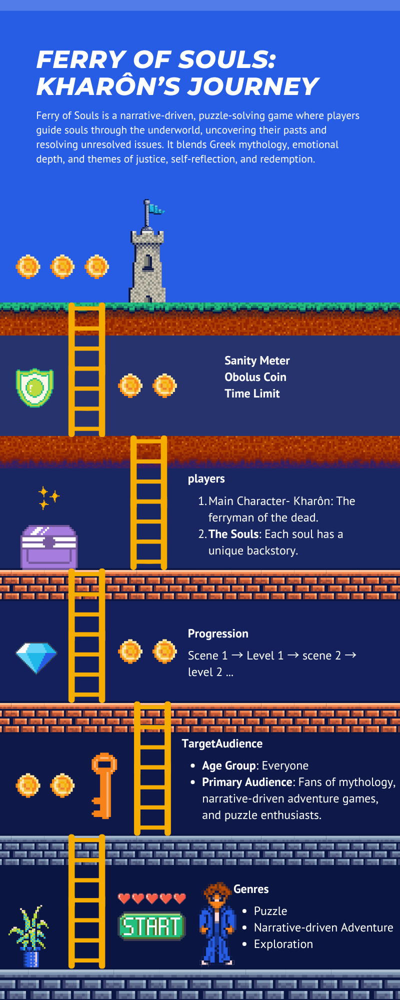

# First Game

This is a Godot project for **Ferry of Souls**.  

## Purpose of the Game
Ferry of Souls aims to provide an immersive narrative-driven experience, blending adventure and puzzle-solving that combines mythological storytelling with challenging navigation and mystery-solving gameplay. Through Kharôn, the ancient Greek ferryman of souls, players guide the deceased through different realms of the underworld, uncovering their pasts and solving riddles that reflect their life's unresolved issues. The player's goal is to uncover the truth behind unjust deaths, help the souls find peace, and earn the obolus coin for each resolved case.

## Intended Use
This game blends Greek mythology with puzzle-solving in an immersive, narrative-driven experience. Designed for solo play, it offers an emotional journey while educating players about mythological stories. It can be used as a stand-alone game or in educational settings, therapy, or personal growth.

## Justification for the Use
The game fosters critical thinking and puzzle-solving by challenging players to use reasoning and deduction to uncover each soul's mystery. By exploring themes of justice, closure, and the afterlife, Ferry of Souls delves into universal concepts of death, offering players philosophical challenges and puzzles that resonate with their own life experiences.

## Target Audience
- **Age Group:** Everyone  
- **Primary Audience:** Fans of mythology, narrative-driven adventure games, and puzzle enthusiasts.  
- **Secondary Audience:** Educators or students interested in interactive storytelling.

## Genres
- Puzzle  
- Narrative-driven Adventure  
- Exploration

## Gameplay
- **Objectives:** Help souls who died unjustly cross the River Styx, solving puzzles and earning obolus coins.  
- **Game Progression and Play Flow:** Levels represent different realms of the afterlife. Players navigate the river, solve puzzles, and uncover the souls’ stories.  
- **Mission, Challenge, or Puzzle Structure:** Multi-layered puzzles based on dialogue, environmental clues, and interactions with souls.